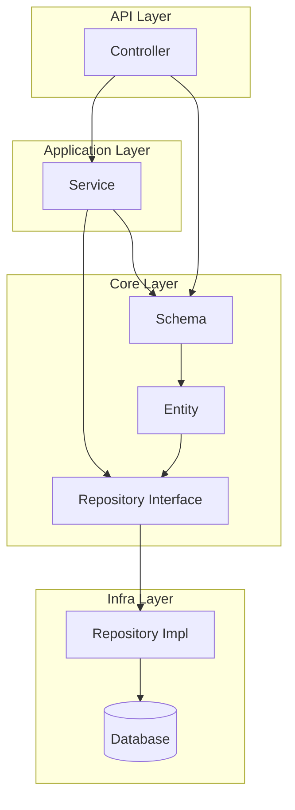
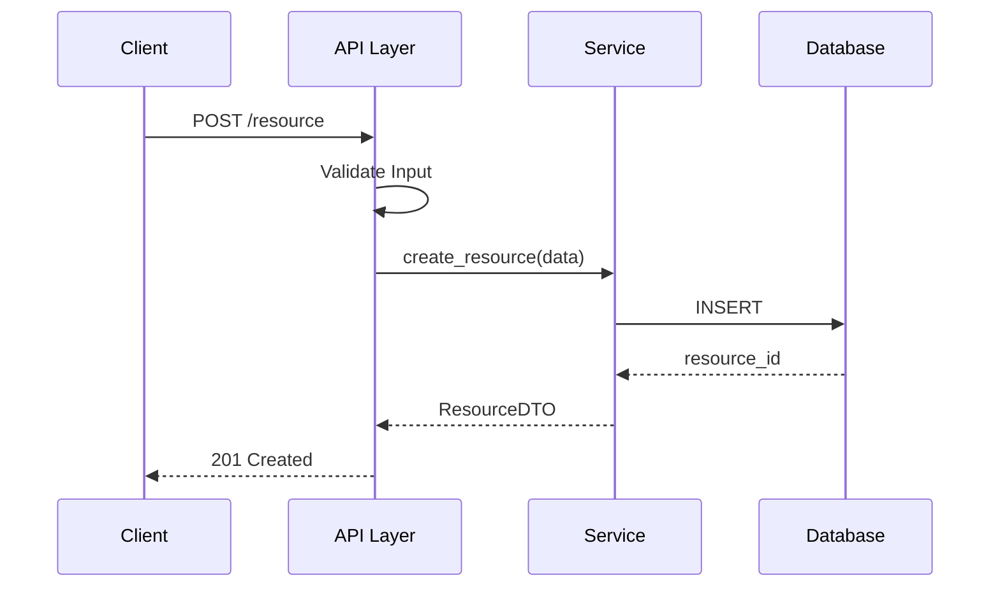
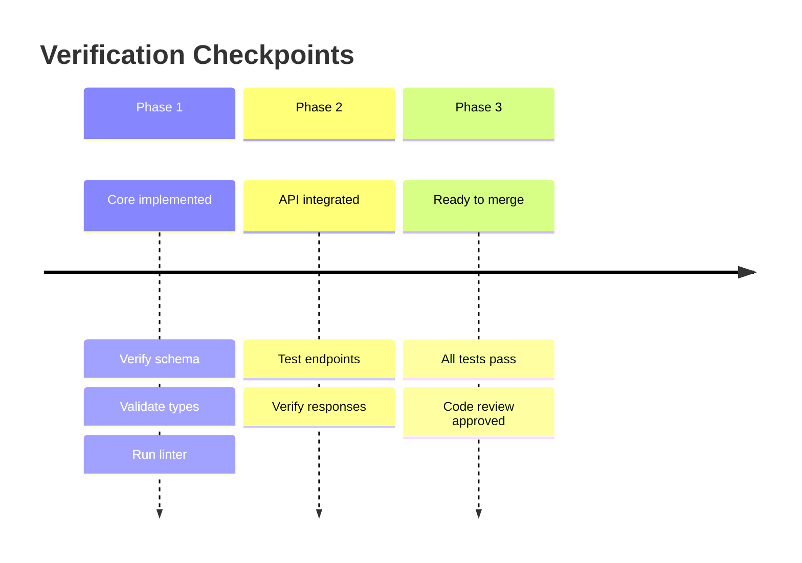
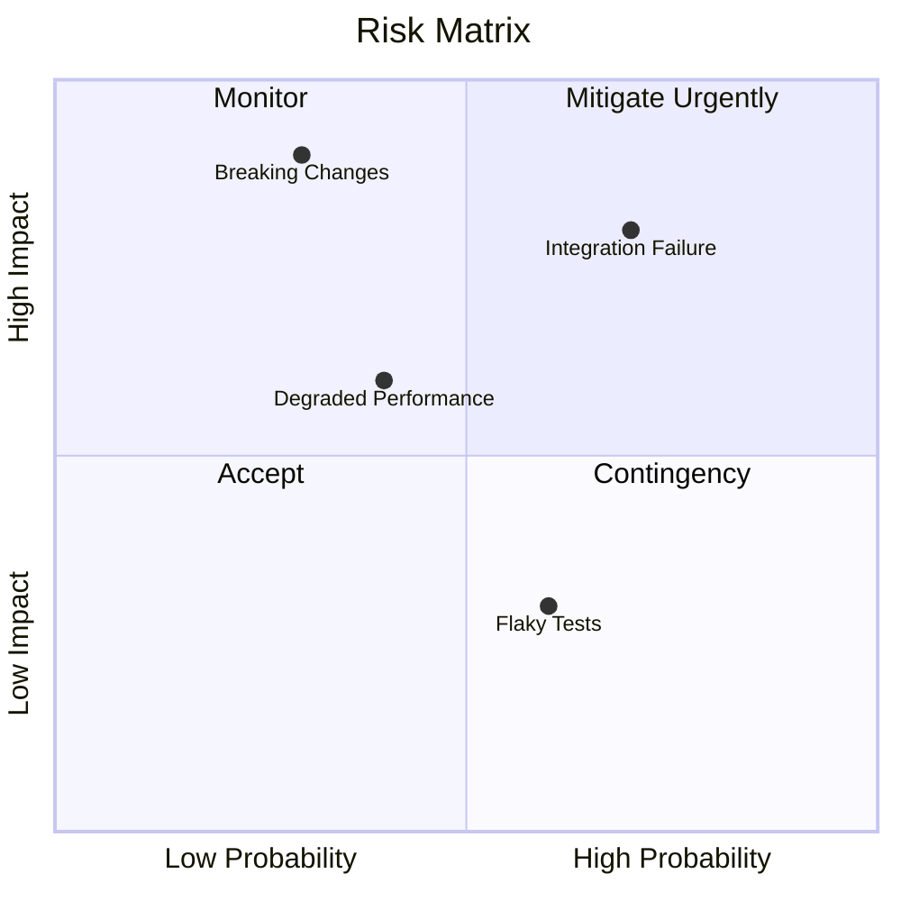

# Visual Templates — detailed (on demand)

**Component of:** implementation-plan
**Purpose:** Extra visual templates for `--visual-level=detailed`
**Loading:** On demand via `Read` — NOT loaded automatically

This file complements `visual-templates.md`. Use `Read` to load it only when
`--visual-level=detailed`.

---

## 1. Dependency Diagram

**Usage:** When there are complex dependencies between layers
**Section:** "2. Technical Design"



---

## 2. Sequence Diagram — Data Flow

**Usage:** When the implementation involves multiple components
**Section:** "2. Technical Design"



---

## 3. Verification Timeline

**Usage:** Show verification checkpoints per phase
**Section:** After "3. Phased Execution"



---

## 4. Visual Risk Matrix

**Usage:** Visualize risks by probability x impact
**Section:** "5. Rollback & Risks"
**Visual Level:** detailed



### Alternative Table

```markdown
| Risk | Probability | Impact | Action |
|------|-------------|--------|--------|
| Integration Failure | High | High | Mitigate |
| Degraded Performance | Medium | Medium | Monitor |
| Breaking Changes | Low | High | Contingency |
```

---

## Integration with Plan Structure

```markdown
## 2. Technical Design
  ### Dependency Diagram   <- HERE
  ### Data Flow            <- Sequence Diagram HERE

## 3. Phased Execution
  ### Checkpoints          <- Timeline HERE

## 5. Rollback & Risks
  ### Risk Matrix          <- Quadrant Chart HERE
```
