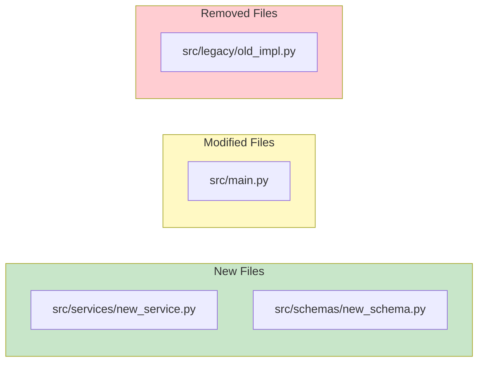
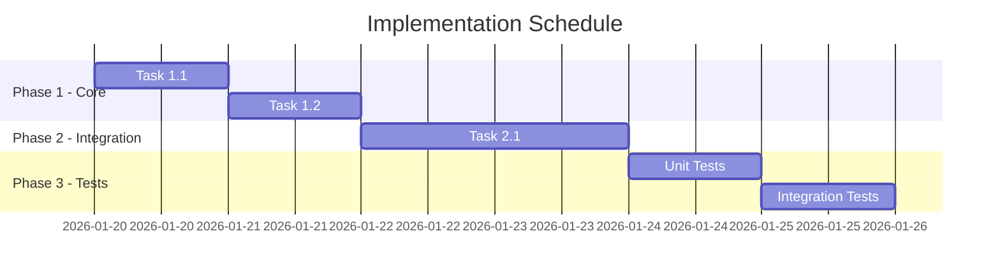
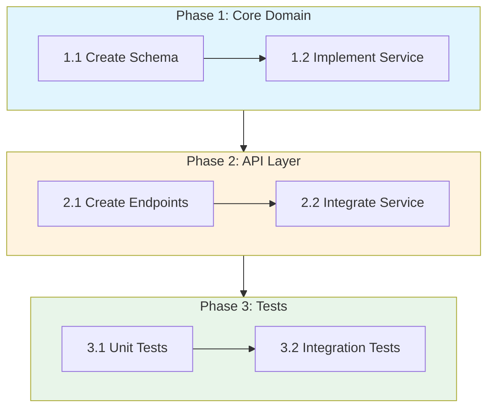

# Visual Templates — minimal & standard

**Component of:** implementation-plan
**Purpose:** Visual templates for the `minimal` and `standard` (default) levels

## Visual Level Configuration

| Level | Elements Included | Source |
|-------|-------------------|--------|
| `minimal` | File impact (ASCII) | This file |
| `standard` | Impact + Gantt + Flowchart + Directory tree (default) | This file |
| `detailed` | All of the above + Dependencies + Sequence + Timeline + Risk Matrix | `Read visual-templates-detailed.md` |

**IMPORTANT**: For `--visual-level=detailed`, use `Read` to load `visual-templates-detailed.md` on demand.

---

## 1. File Impact Diagram

**Usage:** Mandatory at ALL levels
**Section:** Start of the plan, after the header

### Mermaid Template



### ASCII Template (Alternative)

```
File Impact
===========

[+] ADD (2 files)
    ├── src/services/new_service.py
    └── src/schemas/new_schema.py

[~] MODIFY (1 file)
    └── src/main.py

[-] REMOVE (1 file)
    └── src/legacy/old_impl.py

Total: 4 files impacted
```

---

## 2. Gantt Chart — Phase Schedule

**Usage:** Always include in plans with 2+ phases (standard, detailed)
**Section:** After "3. Phased Execution"



---

## 3. Execution Flowchart

**Usage:** Always include to visualize the phase sequence (standard, detailed)
**Section:** Start of "3. Phased Execution"



---

## 4. ASCII Directory Tree

**Usage:** Show the proposed file structure (standard, detailed)
**Section:** Inside "3. Phased Execution"

```
project/
├── src/
│   ├── main.py                 [MODIFY]
│   ├── services/
│   │   └── new_service.py      [ADD]
│   └── schemas/
│       └── new_schema.py       [ADD]
├── tests/
│   └── test_new_service.py     [ADD]
└── docs/
    └── feature.md              [ADD]
```

---

## Best Practices

1. **Consistency**: Same style throughout the plan
2. **Readability**: Max 15 nodes per diagram
3. **Colors**: Green ADD, Yellow MODIFY, Red DELETE
4. **Context**: Every diagram should have explanatory text

## Integration with Plan Structure

```markdown
## 2. Technical Design
  ### Architecture Diagram   <- File Impact HERE

## 3. Phased Execution
  ### Phase Overview         <- Flowchart HERE
  ### Schedule               <- Gantt HERE
  ### File Structure         <- ASCII Tree HERE
```
