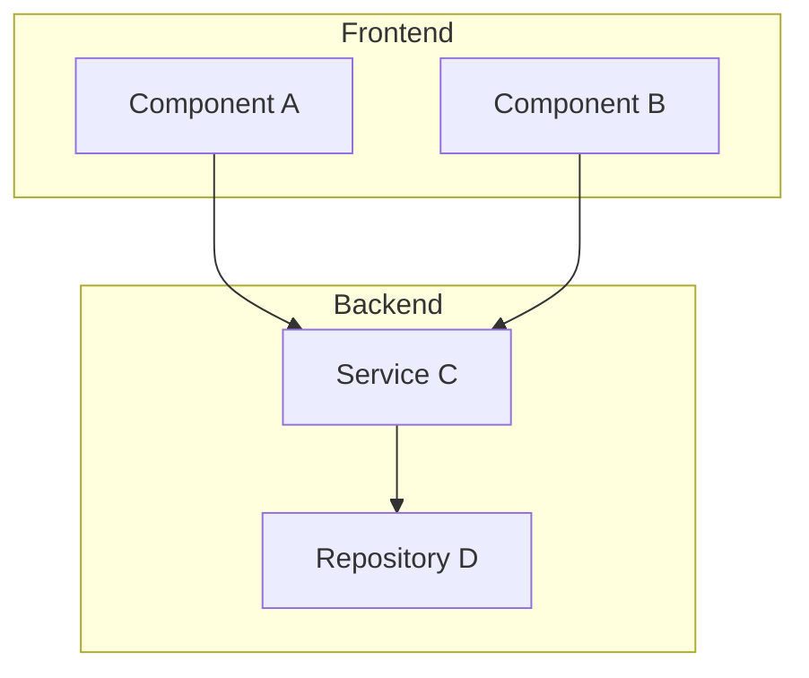
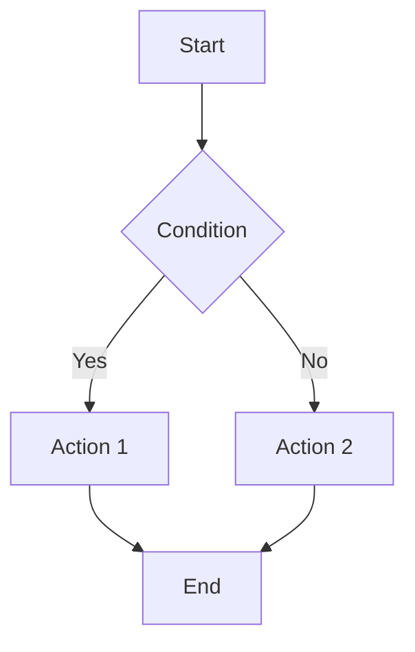
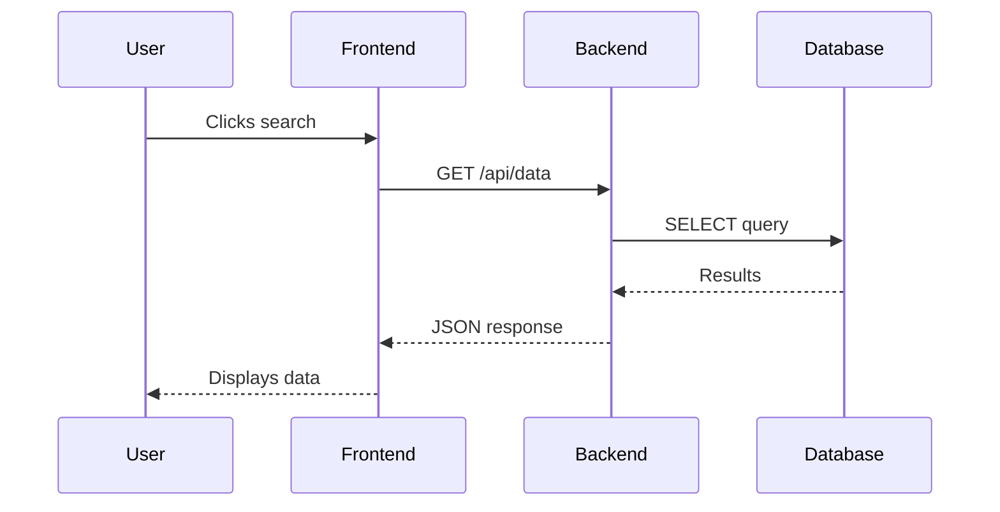
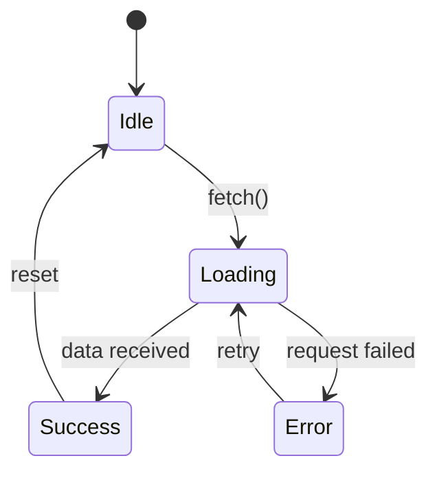
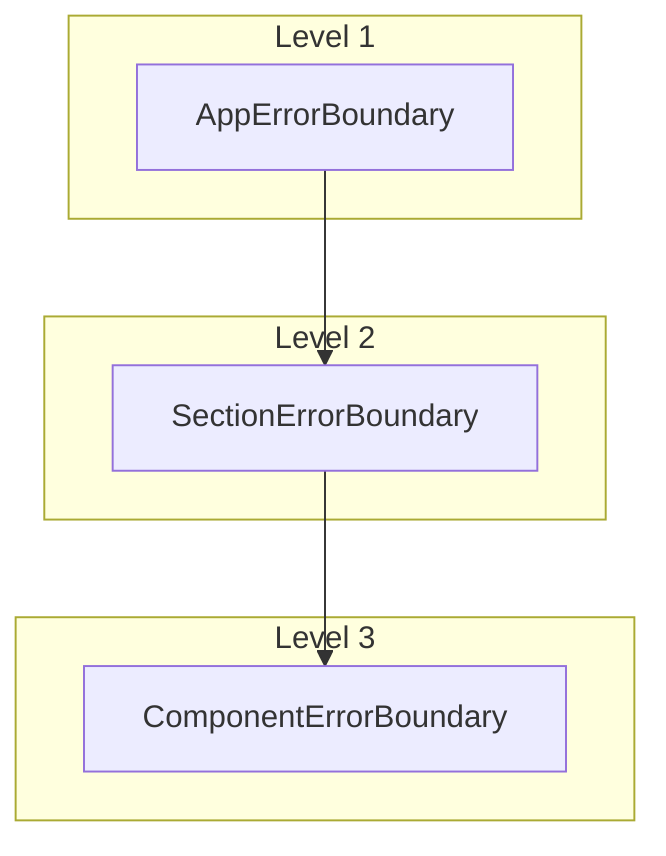

# Mermaid Guidelines Component

**Component of:** walkthrough
**Purpose:** Guidelines for when and how to use mermaid diagrams in walkthroughs.

## When to Use Diagrams

### Include a Diagram When:
- The implementation changed data flow or architecture
- There is complex hierarchy or relationships
- A before/after comparison benefits from visualization
- Multiple components interact

### Do NOT Include When:
- The change is trivial (1-2 files)
- A one-off bugfix with no structural change
- A diagram already exists in a related doc (just reference it)

## Recommended Diagram Types

### 1. Architecture Diagram (simplified C4)



**Use for:** An overview of components and their relationships.

### 2. Flowchart (Process Flow)



**Use for:** Decision flows, step-by-step processes.

### 3. Sequence Diagram (Interactions)



**Use for:** Interactions between multiple components, API calls.

### 4. State Diagram



**Use for:** Component states, state machines.

## ASCII Diagrams (Alternative)

When mermaid does not render well or something simpler is better:

```
Error Boundary Hierarchy:
┌──────────────────────────────────────────────────────────────┐
│  LEVEL 1: AppErrorBoundary (Global)                          │
│  - Catches fatal unhandled errors                            │
├──────────────────────────────────────────────────────────────┤
│  LEVEL 2: SectionErrorBoundary (Per Section)                 │
│  - List Grid, Detail Page                                    │
├──────────────────────────────────────────────────────────────┤
│  LEVEL 3: ComponentErrorBoundary (Critical Components)       │
│  - Charts, Tables                                            │
└──────────────────────────────────────────────────────────────┘
```

```
Capture Flow:
Error in Component
    |
    v
ComponentErrorBoundary catches
    |
    v
Shows inline placeholder
    |
    v
Rest of the page stays functional
```

## Comparison Tables (Alternative to Diagrams)

When a before/after comparison is clearer as a table:

```markdown
| Aspect | Before | After |
|--------|--------|-------|
| Error in component | Crashed the whole app | Isolated with fallback |
| User feedback | Blank screen | Friendly message |
| Logging | None | Console with stack trace |
```

## Best Practices

1. **Simplicity** - A diagram should clarify, not complicate
2. **Legend** - Explain non-obvious notations
3. **Consistency** - Use the same style throughout the walkthrough
4. **Size** - Avoid very large diagrams (max 10-15 nodes)
5. **Context** - Always add explanatory text after a diagram

## Mermaid Limitations in Markdown

- Not all viewers support mermaid
- GitHub and VS Code support it natively
- For maximum compatibility, consider ASCII
- Test the rendering before finalizing

## Usage Example in a Walkthrough

```markdown
## 3. Error Boundary Architecture

### 3.1 Three-Level Hierarchy



The hierarchy allows errors to be caught at the most specific
level possible, preventing the entire application from being
affected by failures in individual components.
```
