# Visual Templates for Walkthroughs

**Component of:** walkthrough
**Purpose:** Visual element templates to enrich technical walkthroughs
**Version:** 1.0

## Overview

This document defines the visual templates for documenting implementations in a visual, comprehensible way. The elements help communicate architectural changes, data flows, and impacts clearly.

## Visual Level Configuration

The `--visual-level` parameter controls the amount of visual elements:

| Level | Elements Included |
|-------|-------------------|
| `minimal` | Modified-file tables only |
| `standard` | Tables + before/after diagram + flowchart (default) |
| `detailed` | All available visual elements |

---

## 1. Before/After Diagram

**Use:** Whenever there is a significant architectural change
**Section:** Architecture/Solution

### Template - Side-by-Side Comparison

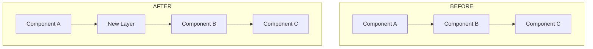

### Template - Evolution with Highlight

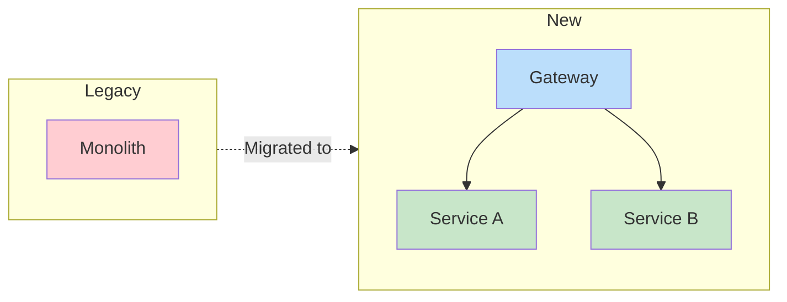

---

## 2. Changes Flowchart

**Use:** When the implementation changes process flows
**Section:** Architecture/Solution

### Template - Decision Flow

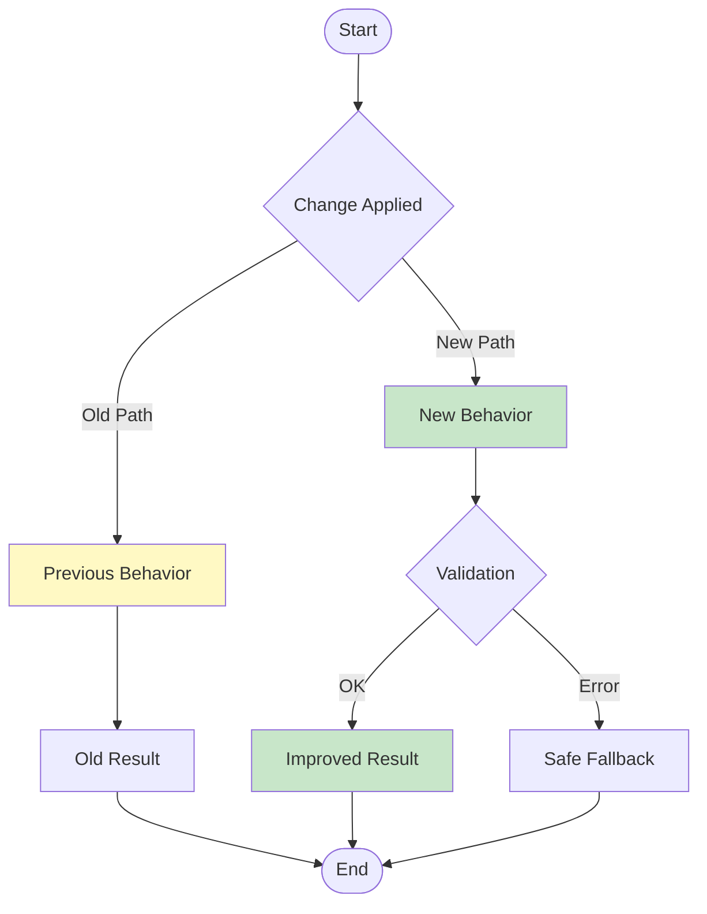

### Template - Data Pipeline

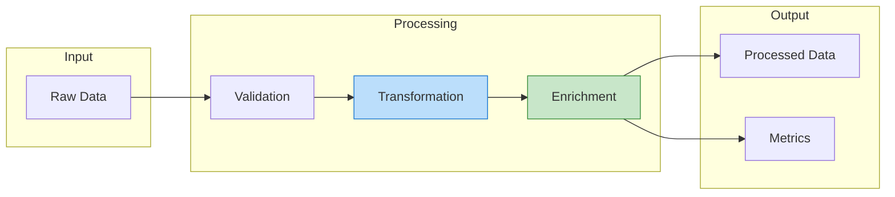

---

## 3. Interactions Sequence Diagram

**Use:** When the implementation affects communication between components
**Section:** Architecture/Solution

### Template - Request Flow

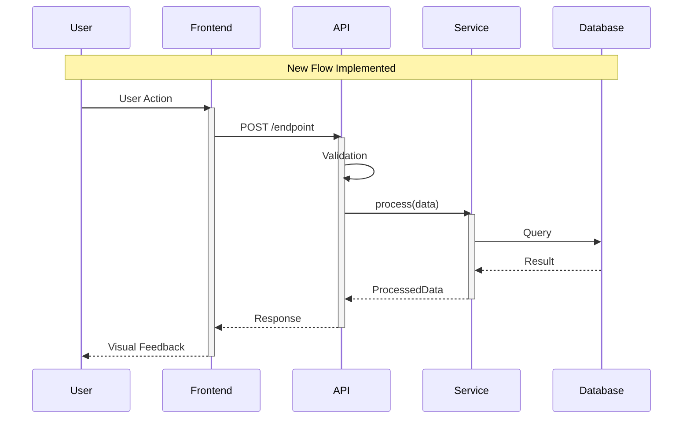

### Template - With Error Handling

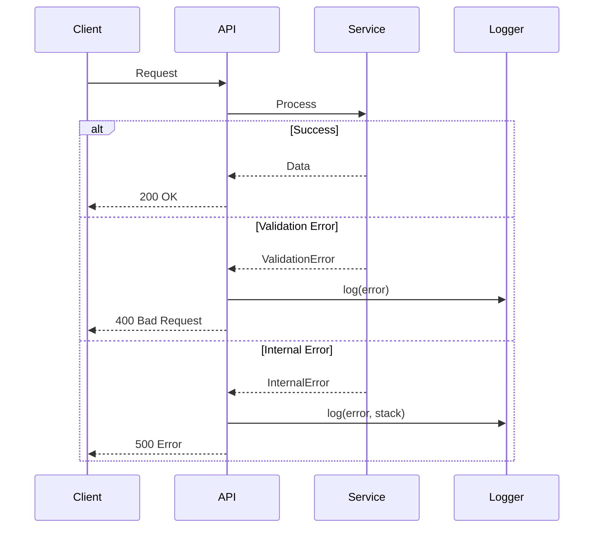

---

## 4. State Diagram

**Use:** When the implementation involves state machines
**Section:** Architecture/Solution

### Template

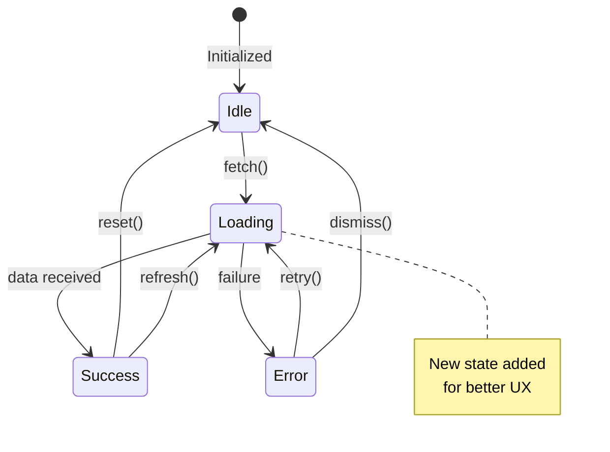

---

## 5. Modified Files Tree

**Use:** Mandatory - show the structure of changes
**Section:** Changes Made

### ASCII Template

```
Project Changes
===============

src/
├── components/
│   ├── Button.tsx          [MODIFIED] +15 -3 lines
│   ├── Modal.tsx           [MODIFIED] +45 -12 lines
│   └── NewFeature/         [NEW DIRECTORY]
│       ├── index.tsx       [CREATED] +120 lines
│       ├── styles.ts       [CREATED] +45 lines
│       └── types.ts        [CREATED] +25 lines
├── hooks/
│   └── useNewFeature.ts    [CREATED] +80 lines
├── services/
│   └── api.ts              [MODIFIED] +20 -5 lines
└── utils/
    └── deprecated.ts       [REMOVED] -150 lines

tests/
├── components/
│   └── NewFeature.test.tsx [CREATED] +95 lines
└── hooks/
    └── useNewFeature.test.ts [CREATED] +60 lines

Summary: +485 added, -170 removed = +315 net lines
```

### Mermaid Template

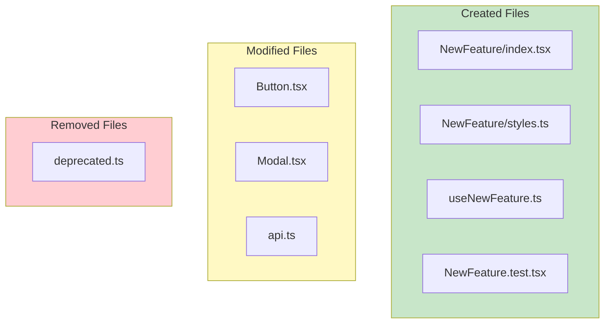

---

## 6. Implementation Timeline

**Use:** For complex features with multiple stages
**Visual Level:** detailed

### Template

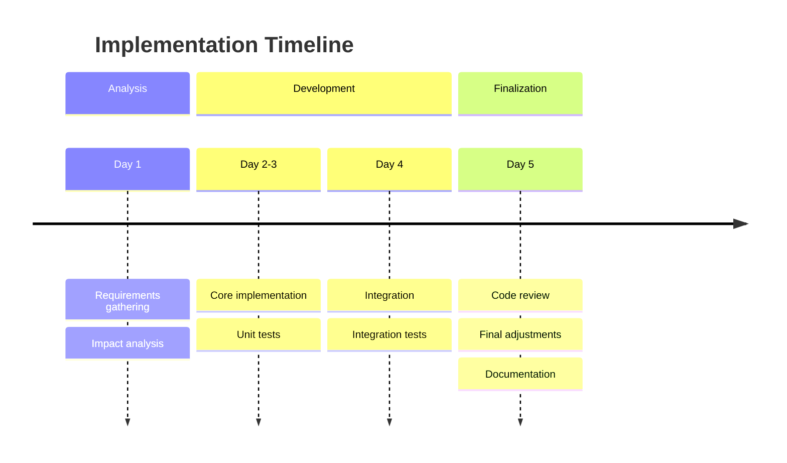

---

## 7. Visual Metrics

**Use:** When there is relevant quantitative data
**Section:** Test Results or Metrics

### Template - Coverage Pie Chart

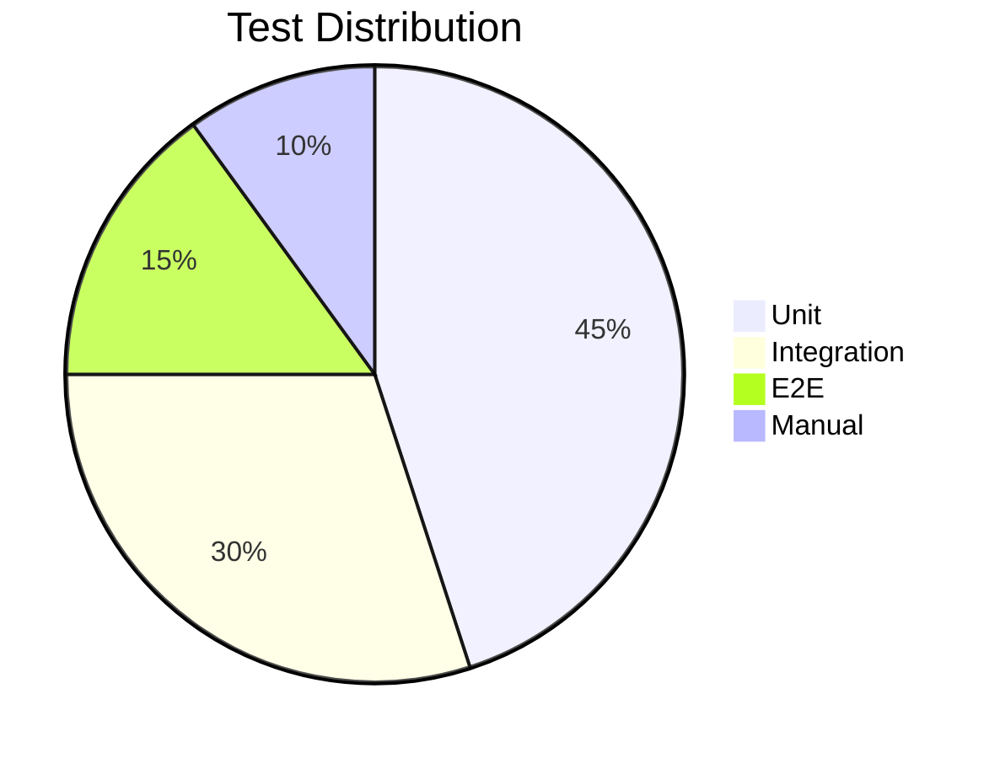

### Template - Distribution by Module

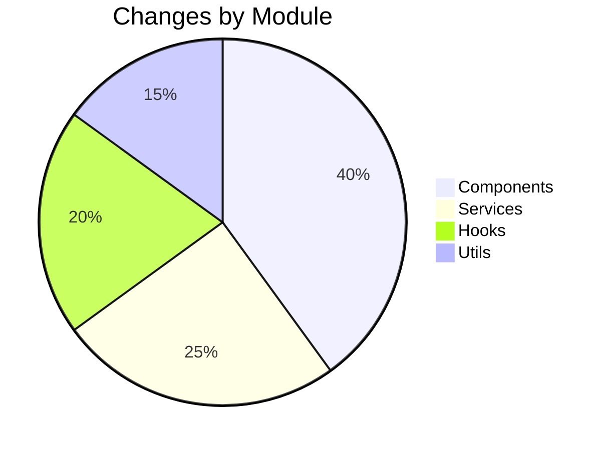

### Metrics Table

```markdown
| Metric | Before | After | Delta |
|--------|--------|-------|-------|
| Lines of Code | 1,234 | 1,549 | +315 |
| Test Coverage | 65% | 78% | +13% |
| Cyclomatic Complexity | 12 | 8 | -4 |
| Build Time | 45s | 38s | -7s |
| Bundle Size | 250KB | 245KB | -5KB |
```

---

## 8. Dependency Diagram

**Use:** When there are changes in dependencies between modules
**Visual Level:** detailed

### Template

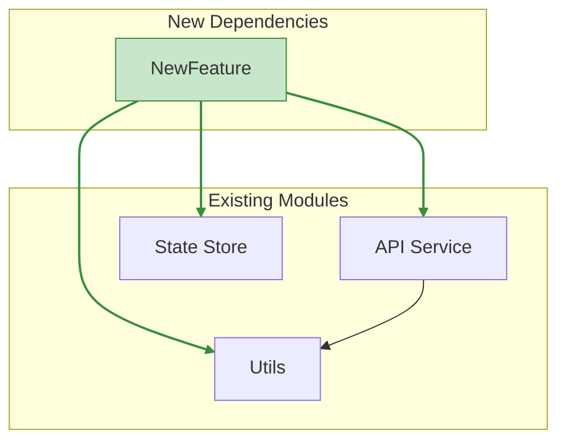

---

## 9. Before/After Comparison Table

**Use:** Visual alternative for behavioral changes
**Section:** Architecture/Solution

### Template

```markdown
| Aspect | Before | After |
|--------|--------|-------|
| **Error Handling** | Crashed the app | Graceful fallback with retry |
| **Performance** | 500ms response time | 150ms (-70%) |
| **UX** | Blank screen while loading | Skeleton + spinner |
| **Maintenance** | Scattered code | Centralized in a hook |
| **Testability** | No tests | 85% coverage |
```

---

## Usage Guide by Visual Level

### minimal

Include only:
- Tables of created/modified/removed files
- A basic metrics table

### standard (Default)

Include:
- File tables
- Before/after diagram OR changes flowchart
- Comparison table
- Structure ASCII tree

### detailed

Include everything above plus:
- Interactions sequence diagram
- State diagram (if applicable)
- Implementation timeline
- Metrics pie charts
- Dependency diagram

---

## Integration with the Report Template

When generating a walkthrough, insert diagrams at the following positions:

```markdown
# Technical Walkthrough - [Title]

[Header with date, status, etc.]

## 1. Summary
[Summary text]

## 2. Changes Made

### Files Tree  <- INSERT HERE
[ASCII tree or Mermaid diagram]

### 2.1 Created Files
[Table]

### 2.2 Modified Files
[Table]

## 3. Architecture

### Before/After Comparison  <- INSERT HERE
[Mermaid side-by-side diagram]

### Data Flow  <- INSERT HERE
[Sequence diagram]

### Comparison Table  <- INSERT HERE
[Markdown table]

## 4. Test Results

### Distribution  <- INSERT HERE (detailed)
[Pie chart]

[Results...]

## 5. Metrics  <- INSERT HERE
[Metrics table with before/after]

## N. Commit Suggestion
[Commit suggestion]
```

---

## Best Practices

1. **Context first**: Always explain the diagram before showing it
2. **Simplicity**: Avoid overly complex diagrams (max 15 elements)
3. **Semantic colors**: Green = new/good, Yellow = modified, Red = removed/problem
4. **Legends**: Include a legend when using special notations
5. **ASCII fallback**: Keep an ASCII version for environments without Mermaid support
6. **Real data**: Metrics must be collected, not estimated
